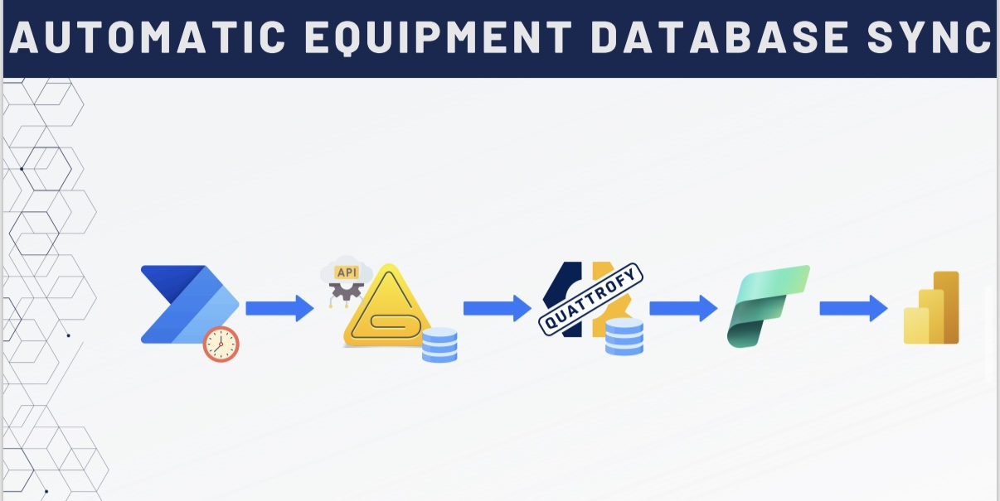
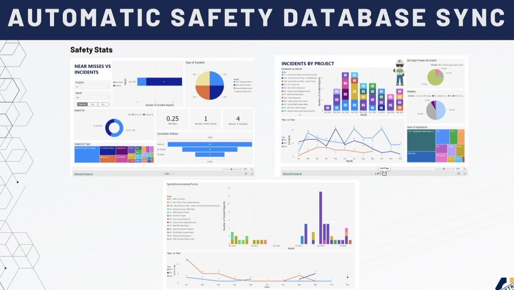

# 🛡️ Safety Sync Flow

## 🧭 Overview
**Safety Sync Flow** is a Microsoft Power Automate flow that runs on a scheduled basis to fetch and sync safety reports from a third-party safety management system into the internal Quattrofy platform. This data is used to generate comprehensive, real-time Power BI dashboards for leadership and safety teams.

## 💡 Objective
To automate the synchronization of safety-related data (incidents, FLHAs, inspections, and hazard IDs) from an external system into Quattrofy. The flow significantly reduces manual work for the Safety department and enhances decision-making with live data visualizations.

### Flow

### Dashboard

---

## ✨ Features
- Scheduled trigger every few hours
- HTTP GET requests to external safety API endpoints
- JSON data parsing and transformation
- Inserts into Azure SQL staging and production tables
- Logs sync status and sends alert emails
- Drives real-time Power BI dashboards
- Robust error handling and retry logic

---

## 📊 Power BI Dashboards
This project enabled the creation of **three fully interactive dashboards**:

1. **Near Misses vs Incidents Overview**
   - Pie and bar charts for type of incidents
   - Incident frequency over time
   - Filters for date, type, and severity
   - Ratio comparisons between near misses and incidents

2. **Incidents by Project**
   - Breakdown of incidents per project
   - Graphs for incidents by day and project
   - Interactive map with incident locations
   - Timeline analysis and heat maps

3. **Hazard ID Submissions**
   - Bar charts showing submissions per project
   - Trends over time by week/month
   - Submission volumes by location

> These dashboards were developed collaboratively:
> - **Data Engineering:** Built by me through flow automation and Azure SQL integration
> - **Dashboard Design:** Created by the Project Controls Manager using Power BI

---

## ⚙️ Tech Stack

| Category            | Technologies |
|---------------------|--------------|
| **Automation**      |  |
| **API Integration** |  |
| **Database**        |   |
| **Visualization**   |  |
| **Hosting**         |  |

---

## 🔄 Flow Logic
1. **Trigger:** Recurs every X hours
2. **Pull Data:** API calls to `/incidents`, `/flha`, `/hazard-ids`
3. **Parse & Clean:** Normalize incoming JSON into relational schema
4. **Insert to DB:** Push data into Azure SQL for reporting
5. **Logging:** Record sync results and notify stakeholders

---

## 📈 Results & Impact
- ⏱️ Reduced manual data entry by 95%
- 📉 Lowered dashboard update delays from days to minutes
- 📊 Enabled leadership to access real-time safety insights
- 🧠 Improved risk response with better data visibility

---

## 🔐 Security & Reliability
- Encrypted HTTP headers and credentials
- Retry logic for failed syncs
- Logs each run in a secure audit trail

---

## 🔗 Related Projects
- `Quattrofy` – Main enterprise system
- `Safety Power BI Dashboards` – Real-time visualizations
- `Project Sync Flow` – Schedules system-wide data consistency
